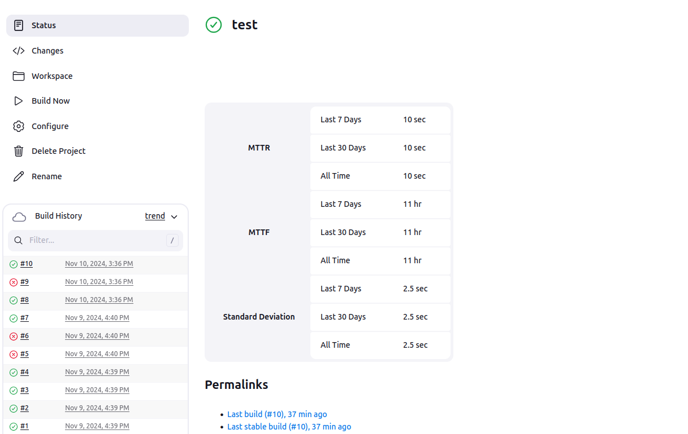
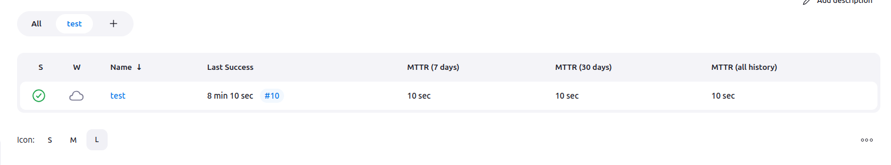

Jenkins Build History Metrics Plugin
======================================

This plugin calculates the following metrics for all of your builds once
installed

The plugin doesn't support pipeline jobs (contributions are welcome).

-   Mean Time To Failure (MTTF)
-   Mean Time To Recovery (MTTR)
-   Standard Deviation of Build Times

The calculated metrics are displayed in a table on each jobs page
showing the metric for the last 7 days, last 30 days and all time.  The
table looks something like this:

The plugin also add new column definitions

## Changelog

Changelog is now published on GitHub releases page

### 1.2

-   Standard deviation for build times is now calculated and displayed
-   Some styling changes for the table to make it look a bit better

### 1.1

-   First stable release that is a fork of an old plugin, refactored
    with more tests and extended to include both MTTF and MTTR metrics
